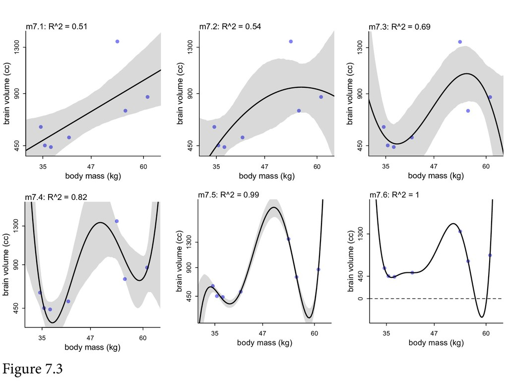
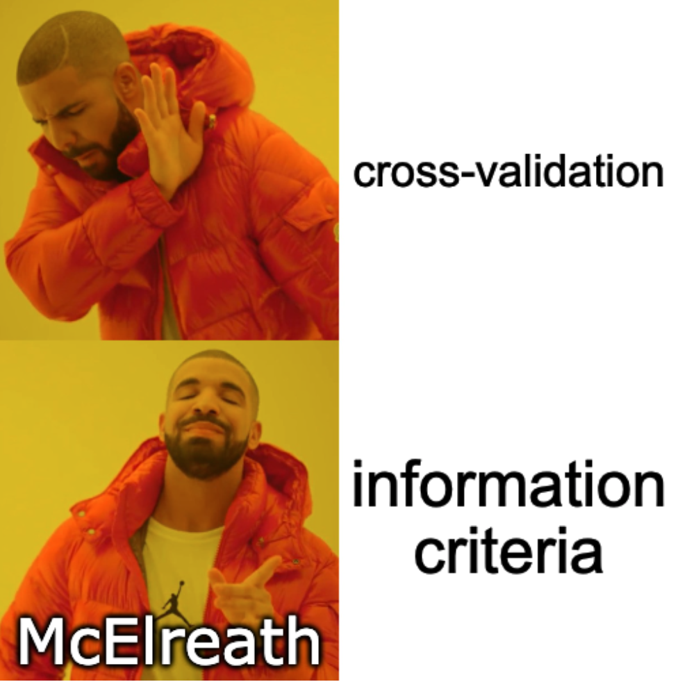

# Ulysses' compass

These are some [slides](big.html) for a book club discussion of
Chapter 7 from McElreath's [Statistical Rethinking][]. See also
McElreath's own [slides and video presentations][].

[Statistical Rethinking]: https://xcelab.net/rm/statistical-rethinking/
[slides and video presentations]: https://github.com/rmcelreath/statrethinking_winter2019


-----

```
🐉 Scylla of overfitting
  ⛵ Ulysses' compass 🧭
🌪 Charybdis of underfitting
```

-----

The title of the chapter is "Ulysses' Compass." McElreath loves to
give his chapters cute names that don't necessarily mean anything to
you until you've read the chapter.

What do we value: simplicity or accuracy? The chapter is about
navigating between overfitting and underfitting, which McElreath notes
briefly (page 201) is related to but distinct from the bias variance
trade-off. I think the difference he's alluding to is about what a
model is _capable_ of representing (bias/variance) vs. what it _does_
represent (under/overfitting).


-----



-----

In section 7.1, "The problem with parameters" is that too many can
make it easy to overfit. It's a fairly standard presentation of
overfitting via polynomial regression and hating on R<sup>2</sup> (or
any naive score on the training data).


-----

```python
from math import log

# Truth (as in Problem 7E1)
p = [0.7, 0.3]  # heads, tails
```

-----

So now it's time to do [information theory][]. Here we go!

[information theory]: https://en.wikipedia.org/wiki/Information_theory

This section was the most interesting to me, so I'm going to spend
some time on it here. I felt like his explanations were helpful, and
I've encountered the material in less cogent ways previously, so I
appreciated the chance to think things through all together a bit.

I'll do a running example where the true probabilities of heads and
tails for a coin (say) are 0.7 and 0.3. (We never really know the true
probabilities.)


-----

```python
# Entropy, H(p)
H = lambda p: -sum(p_i * log(p_i) for p_i in p)
H(p)  # 0.6108643020548935
```

-----

So we get entropy, which measures how uncertain things are. (He gives
some motivating criteria and implies it could be derived.)


-----

```python
# Candidate "models"
q = [0.5, 0.5]
r = [0.9, 0.1]
```

-----

So say we have these two "models" for that coin.

(These are just point estimates, not whole posterior distributions.)


-----

```python
# Cross-Entropy, H(p, q), xH here because Python
xH = lambda p, q: -sum(p_i * log(q_i) for p_i, q_i in zip(p, q))
xH(p, q)  # 0.6931471805599453
xH(p, r)  # 0.764527888858692
```

-----

Cross-entropy tells us something about how well a model goes with the
truth. (Well; how un-well: lower scores are better.)

The best score is what you get using the true model, which is the
entropy of the true model.

In lots of my models, we use cross-entropy loss, and we generally just
implicitly round all the "true" probabilities to one or zero, or do
something nearly as unjustified.


-----

```python
# KL Divergence, D(p, q)
D = lambda p, q: sum(p_i * log(p_i/q_i) for p_i, q_i in zip(p, q))
D(p, q)  # 0.08228287850505178
D(p, r)  # 0.15366358680379852
```

-----

Divergence then is just cross-entropy with the entropy subtracted off,
so that the best you can do is zero.


-----

```python
# D(p, q) = H(p, q) - H(p)
D(p, q) == xH(p, q) - H(p)  # True
```

-----

The other one doesn't happen to come out exactly due to floating point
math; what luck that the first one does!

So we wish we could use divergence to evaluate models, but we can't
because we never really know the true underlying model `p`. All we get
are data.

(If instead we're assuming that all the data is really 100% likely,
then H(p) is 0 and there's nothing to subtract off.)

The key insight in general is that even if we don't know `p`, when we
compare two models' scores by subtracting them, the `p` goes away, so
we can still get relative scores even without `p`.


-----

```python
# Data
d = [0, 0, 1]  # heads, heads, tails
```

-----

So here are some data.


-----

```python
# Log probability (likelihood) score
S = lambda d, p: sum(log(p[d_i]) for d_i in d)
S(d, q)  # -2.0794415416798357
S(d, r)  # -2.513306124309698
```

-----

So we switch now to just using the sum of log likelihoods of the data
given the model as the model's score.

This score is the same as the "cross-entropy" I often use, which is
the same also as divergence, when we're saying all the true
probabilities are zero or one.

Higher scores are better here.


-----

Positive log likelihoods happen!

-----

Positive log likelihoods caused me a little bit of consternation,
because I'd been thinking in terms of probabilities rather than
probability distributions. But really when you have a distribution,
you're using a density, which can be greater than one. So the log
could be positive.


-----

```python
# True vs. predictive
S(d, p)  # -1.917322692203401
S(d, [2/3, 1/3])
         # -1.9095425048844388
```

-----

The true model isn't necessarily the one that scores best on a given
sample of data.


-----

```python
# Deviance
deviance = lambda d, p: -2 * S(d, p)
S(d, p)         # -1.917322692203401
deviance(d, p)  #  3.834645384406802
```

-----

Then it's also common to switch to deviance, to make something nice
happen with chi-squared distributions or something. Now smaller scores
are better.


-----

*Regular*ization!

-----

From the information theory stuff, he really wants to develop
information criteria, but first he talks about regularization.

He points out that it's sort of about pulling out the "regular"
patterns in the data, rather than overfitting to chance patterns. Nice
little mnemonic.

Bayesians are pretty smug about regularization, because they get it
essentially for free by adjusting their priors.

The chapter also has some material on robust regression, which
Bayesian's are also pretty smug about because it's relatively easy for
them to just swap out the normal distribution for something with
fatter tails.


-----



-----

Next it's on to "Predicting predictive accuracy." McElreath talks a
little bit about cross-validation, but it's pretty clear his true love
is information criteria.

I generally prefer (read: "actually use") cross-validation.


-----

 * AIC: Akaike Information Criterion
 * BIC: Bayesian Information Criterion (aka Schwarz criterion)
 * CV: Cross-Validation
 * DIC: Deviance Information Criterion
 * lppd: Log Pointwise Predictive Density
 * PSIS: Pareto-smoothed importance sampling cross-validation
 * R^2: "variance explained" or "coefficient of determination"
 * WAIC: [Widely Applicable | Watanabe-Akaike] Information Criterion

-----

So he talks about his favorites, PSIS and WAIC. They seem fine.


-----

compare but don't select

-----

Then he says not to do model selection, in the sense of throwing out
models and what you learned from them in the process.


-----

```
# Mine (Python)
def sum_log_prob(a, b):
    return max(a, b) + math.log1p(math.exp(0 - abs(a - b)))

# McElreath's (R)
log_sum_exp <- function( x ) {
    xmax <- max(x)
    xsum <- sum( exp( x - xmax ) )
    xmax + log(xsum)
}
```

-----

Little sidebar (as also McElreath had one): Multiplying probabilities
that you have the logs of is easy, because you just add the logs.
Adding log probabilities is more annoying. But you can be a little
clever about it and it works out! I needed this recently while playing
with the [St. Petersburg paradox][].

[St. Petersburg paradox]: https://en.wikipedia.org/wiki/St._Petersburg_paradox

Mine is based on a [post from Kevin Karplus][]. I found McElreath's on
a [post on rdrr][].

[post from Kevin Karplus]: https://gasstationwithoutpumps.wordpress.com/2014/05/06/sum-of-probabilities-in-log-prob-space/
[post on rdrr]: https://rdrr.io/github/rmcelreath/rethinking/src/R/distributions.r


-----

Ulysses' compass

 * Don't overfit
 * Use log likelihood
 * Use CV and/or IC

-----

So that about wraps it up!

See also my [notes and quotes][] from the chapter.

[notes and quotes]: https://github.com/ajschumacher/ajschumacher.github.io/issues/216#issuecomment-748518338
