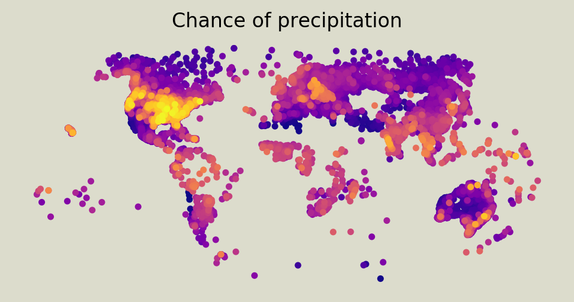
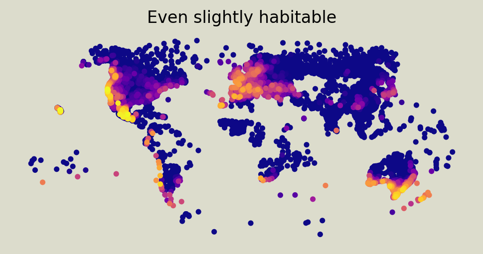

# The weather outside is frightening

Based on ten years of daily GHCN data, it is too cold, too hot, and
too wet out there. Best chances for livable weather: parts of the
Mexican plateau, California, and maybe Hawaii.

---

### <a name="temp" href="#temp">Temperature</a>

Lots of land is up north where it gets cold, and everything around the
equator gets too hot. Is there a Goldilocks region in between that's
"just right" year-round? No. Your best hope is Stockholm syndrome: "I
love the seasons!"

To get a moderate temperature all year, you have to rely on oceans, or
mountainous elevations, or both. Thanks a lot, solar system.

### <a name="prcp" href="#prcp">Precipitation</a>

Even with over 15 thousand stations and ten years of [GHCN][] data,
there's spotty coverage for Africa, South America, and Asia. It also
looks like the US precipitation data may be systematically different
from Canadian and Mexican data. Thanks a lot, humans.

[GHCN]: https://www.ncdc.noaa.gov/data-access/land-based-station-data/land-based-datasets/global-historical-climatology-network-ghcn

Precipitation: Can't live with it, can't have nice plants without it.
Thanks a lot, water cycle. Let's say once every six to nine days is
acceptable to avoid deserts.

### <a name="habitable" href="#habitable">Habitable areas</a>

Mexico! With ocean on two sides and a high plateau to cut the
temperature and humidity, Mexico ought to be where everybody lives.
[Zacatecas][] seems particularly good.

[Zacatecas]: https://weather-and-climate.com/average-monthly-Rainfall-Temperature-Sunshine,zacatecas-zacatecas-mx,Mexico

California has some okay spots, like San Diego and Monterey. Look out
for forest fires.

Hawaii isn't out of bounds, but even the lows are high, so if you
aren't at the beach it might not be ideal. Avoid the volcanoes.

Then there are survivable places, including lots of the west coast of
the Americas, New Zealand, and the southern coast of Australia. The
tip of South Africa and large parts of Europe could be okay. I think
that's roughly Japan and Korea seeming not quite deadly.

### <a name="methods" href="#methods">Methods</a>

This slapdash analysis [gathers some data][] and visualizes it with a
Python [notebook][], which has all the details and a few more fun
maps.

[gathers some data]: https://github.com/ajschumacher/ajschumacher.github.io/blob/master/20201230-weather_outside_is_frightening/prepare_data.sh
[notebook]: https://github.com/ajschumacher/ajschumacher.github.io/blob/master/20201230-weather_outside_is_frightening/visualize.ipynb

The chances of cold, heat, and precipitation are fractions of days
with low temperature under 0° C (32° F), high temperature over 30° C
(86° F), and precipitation over one millimeter, respectively. The
precipitation score may have issues. The scales on these maps go all
the way from 0% to 100%, using the plasma color scale. Legends are
ugly.

A location's score is the sum of the cold score, hot score, and
distance of the precipitation score from the range 1/6 to 1/9. It's
not quite a rate any more, just a badness score. The "Most habitable"
map colors scores less than 1/4, and the "Even slightly habitable" map
colors scores less than 3/5. _Do you really want to live somewhere
with a score over 60%?_
