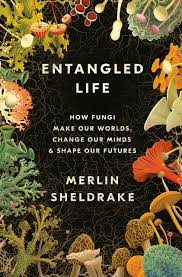

# Entangled Life, by Sheldrake

Would you like to simulate a night at the bar with your smart friend
who's just _really_ into 'shrooms? Then [Entangled Life][] is for you!
Explore lots of symbioses and ask questions like "Is nature
fundamentally competitive or cooperative?" (page 210) It's a good
time!

[Entangled Life]: https://www.merlinsheldrake.com/entangled-life

 * Introduction: What is it like to be a fungus? (the author takes LSD)
 * Chapter 1: A lure ([truffles][])
 * Chapter 2: Living labyrinths ([mycelium][];
   [women gathering mushrooms song][])
 * Chapter 3: The intimacy of strangers ([lichens][];
   [Ways of Enlichenment][]; [Queer theory for lichens][];
   [Lynn Margulis][] and mitochondria)
 * Chapter 4: Mycelial minds ([The Girl with All the Gifts][] but
   really; [magic mushrooms][])
 * Chapter 5: Before roots ([mycorrhizae][];
   [The Vertical Earth Kilometer][])
 * Chapter 6: Wood Wide Webs ([mycorrhizal networks][])
 * Chapter 7: Radical mycology (using fungi for stuff; [Ecovative][])
 * Chapter 8: Making sense of fungi (fermentation etc.)
 * Epilogue: This compost ([the book itself][])

[The Vertical Earth Kilometer]: https://www.diaart.org/visit/visit-our-locations-sites/walter-de-maria-the-vertical-earth-kilometer-kassel-germany
[truffles]: https://en.wikipedia.org/wiki/Truffle
[mycelium]: https://en.wikipedia.org/wiki/Mycelium
[women gathering mushrooms song]: https://www.youtube.com/watch?v=DlYzIUXlpQE
[lichens]: https://en.wikipedia.org/wiki/Lichen
[Ways of Enlichenment]: https://www.waysofenlichenment.net/
[Queer theory for lichens]: https://core.ac.uk/download/pdf/235683163.pdf
[Lynn Margulis]: https://en.wikipedia.org/wiki/Lynn_Margulis
[The Girl with All the Gifts]: https://en.wikipedia.org/wiki/The_Girl_with_All_the_Gifts_(film)
[magic mushrooms]: https://en.wikipedia.org/wiki/Psilocybin_mushroom
[mycorrhizae]: https://en.wikipedia.org/wiki/Mycorrhiza
[mycorrhizal networks]: https://en.wikipedia.org/wiki/Mycorrhizal_network
[Ecovative]: https://ecovativedesign.com/
[the book itself]: https://images.squarespace-cdn.com/content/5decd1106597cc7e187b46cc/1590402213148-9Y7AUCTU4N6BQ4JXTGFJ/US-entangled-life-cover-34_DARK_compressed.jpg

Sheldrake spins a charming tale, but may be taking some liberties. For
example, he claims on page 129 that "Miycorrhizal fungi soon found
their way into _The Lord of the Rings_." The quotes he follows this
with do not clearly support that claim, and there's no further
evidence to be found in the text or endnotes.

The author at one point addresses concerns about anthropomorphism,
especially relevant to considerations of "intelligent" behaviors, but
has few reservations about using metaphor freely. This isn't all bad.

> "It is well-established in the sciences that metaphors can help to
> generate new ways of thinking. The biochemist Joseph Needham
> described a working analogy as a "net of coordinates" that could be
> used to arrange an otherwise formless mass of information, much as a
> sculptor might use a wire frame to provide support for wet clay. The
> evolutionary biologist Richard Lewontin pointed out that it is
> impossible to "do the work of science" without using metaphors,
> given that almost "the entire body of science is an attempt to
> explain phenomena that cannot be experienced directly by human
> beings." Metaphors and analogies, in turn, come laced with human
> stories and values, meaning that no discussion of scientific
> ideas–this one included–can be free of cultural bias." (page 211)

Together with frequent stories, it makes for engaging reading. I
generally prefer the viewpoint he gives a paragraph to on page 174,
when he quotes Toby Spibille: "I try just to look at the system and
let the lichen be a lichen."

---

### Fun words

 * anastomose: cross-connect between adjacent channels, tubes, fibers,
   or other parts of a network
 * [brocade][]: a kind of fancy cloth
 * [cannula][]: a thin tube inserted into a vein or body cavity to
   administer medicine, drain off fluid, or insert a surgical
   instrument
 * deliquesce: become liquid, typically during decomposition
 * esculent: fit to be eaten; edible (or: a thing that is)
 * [holobiont][]: entity composed of multiple symbiotic members
 * [liana][]: a long-stemmed, woody vine that climbs up trees
 * [loupe][]: a hand-lens; a magnifying glass with no handle
 * molder: slowly decay or disintegrate, especially because of neglect
 * nostrum: a medicine, especially one that is not considered
   effective, prepared by an unqualified person
 * torpor: a state of physical or mental inactivity; lethargy

[brocade]: https://en.wikipedia.org/wiki/Brocade
[cannula]: https://en.wikipedia.org/wiki/Cannula
[holobiont]: https://en.wikipedia.org/wiki/Holobiont
[liana]: https://en.wikipedia.org/wiki/Liana
[loupe]: https://en.wikipedia.org/wiki/Loupe
